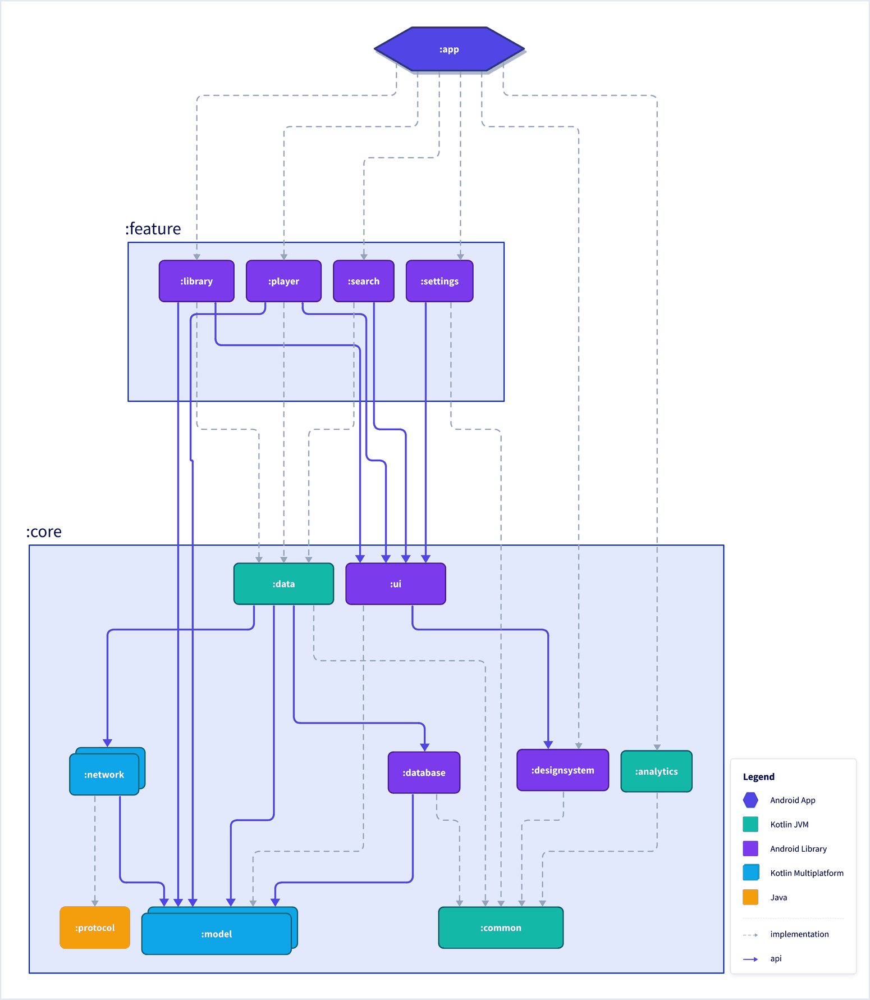
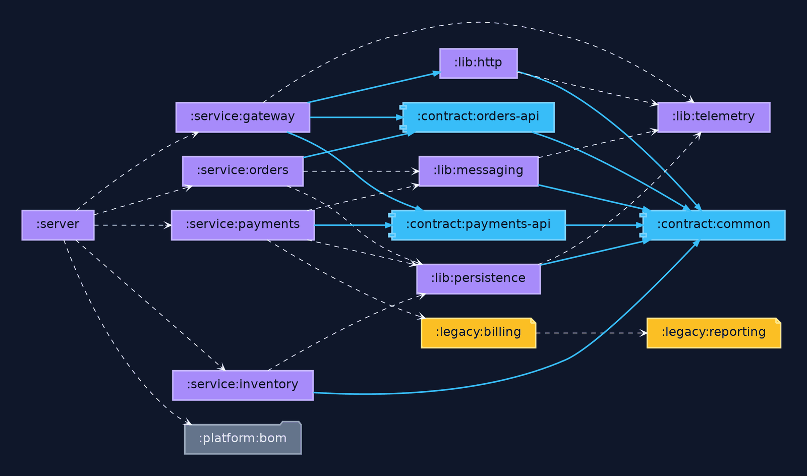
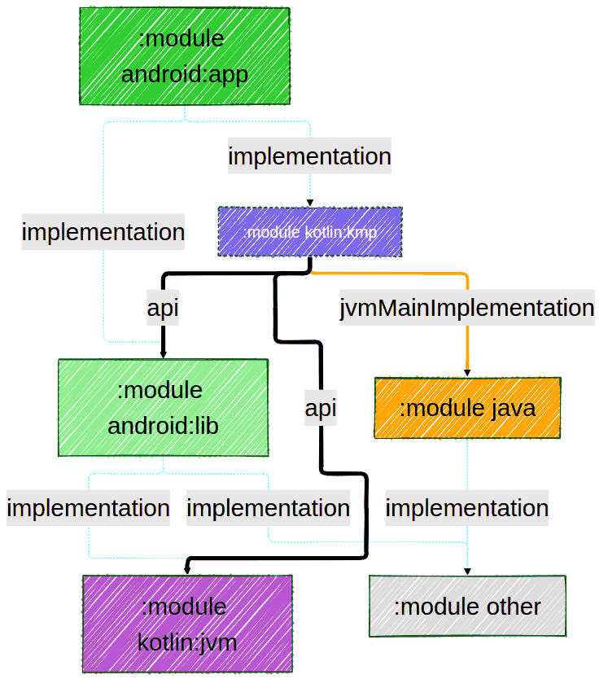

# Atlas Gradle Plugin

[](https://central.sonatype.com/artifact/dev.jonpoulton.atlas/plugin)
[](./LICENSE.txt)

A Gradle settings plugin for generating diagrams of your project's module structure. Supported frameworks:

- [D2](https://d2lang.org/)
- [Graphviz](https://graphviz.org/)
- [Mermaid](https://mermaid.js.org/)

You can choose any one of the above, or any combination of them.

## Quick start

In `settings.gradle.kts`:

```kotlin
pluginManagement {
  repositories {
    mavenCentral()
  }
}

plugins {
  id("dev.jonpoulton.atlas") version "<version>"
}

include(":app", ":core")

atlas {
  projectTypes { useDefaults() }
  mermaid()
}
```

Nothing is generated until you configure at least one framework block. Your subprojects need no changes - the settings plugin wires up every project in the build.

Then:

```shell
# write the diagrams
gradle atlasGenerate

# verify they match the current project structure. Useful in CI if you commit the diagrams
gradle atlasCheck
```

# Usage

[See here](https://jonapoul.github.io/atlas-gradle-plugin) for a full usage/configuration reference, or the [sample projects](./samples/) for full example implementations.

# Examples

The same plugin, three renderers, each pointed at a different kind of build. See the [sample projects](./samples/) for the full configs.

| [D2](https://jonapoul.github.io/atlas-gradle-plugin/usage-d2/) | [Graphviz](https://jonapoul.github.io/atlas-gradle-plugin/usage-graphviz/) | [Mermaid](https://jonapoul.github.io/atlas-gradle-plugin/usage-mermaid/) |
|---|---|---|
|  |  |  |
| A 14-module Android app, grouped into `:app`, `:feature` and `:core`. ELK layout, per-type shapes and fills, an embedded legend | A 15-module JVM backend of services, shared libs, API contracts and legacy Java. Left-to-right `dot` layout with custom node, edge and graph attributes | Hand-drawn look, the Forest theme, ELK tuning and custom theme variables |

## License

```
Copyright (C) 2025 Jon Poulton

Licensed under the Apache License, Version 2.0 (the "License");
you may not use this file except in compliance with the License.
You may obtain a copy of the License at

   https://www.apache.org/licenses/LICENSE-2.0

Unless required by applicable law or agreed to in writing, software
distributed under the License is distributed on an "AS IS" BASIS,
WITHOUT WARRANTIES OR CONDITIONS OF ANY KIND, either express or implied.
See the License for the specific language governing permissions and
limitations under the License.
```
