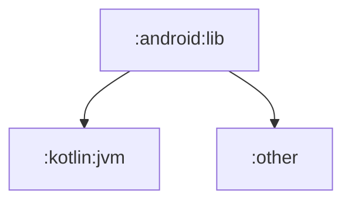

# android:lib

<!--region chart-->

```mermaid
graph TD
  _android_lib[":android:lib"]
  _kotlin_jvm[":kotlin:jvm"]
  _other[":other"]
  _android_lib --> _kotlin_jvm
  _android_lib --> _other
```
<!--endregion-->